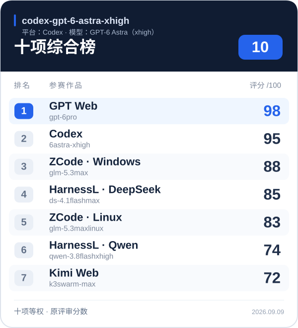
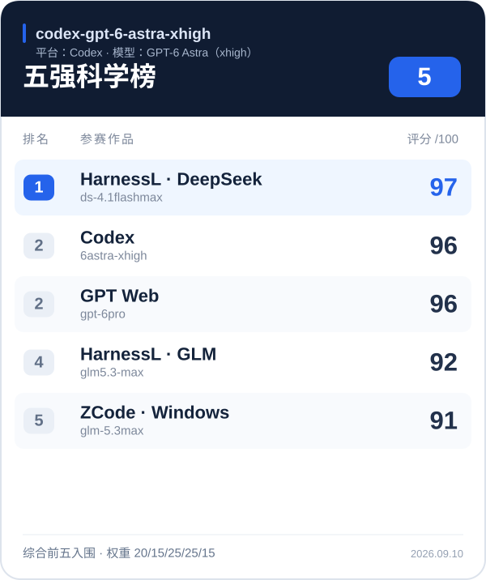
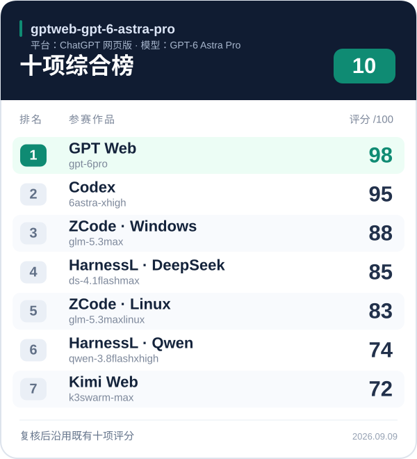
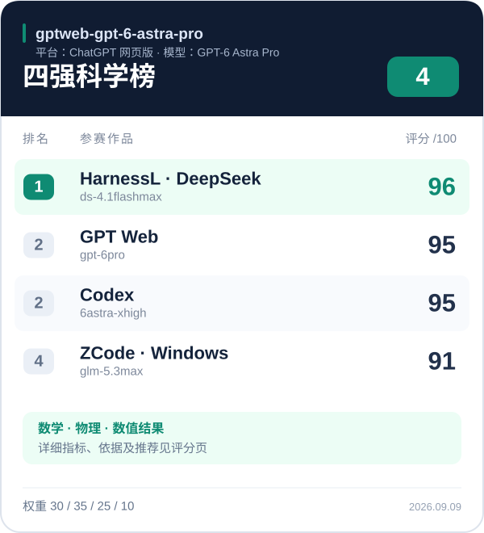
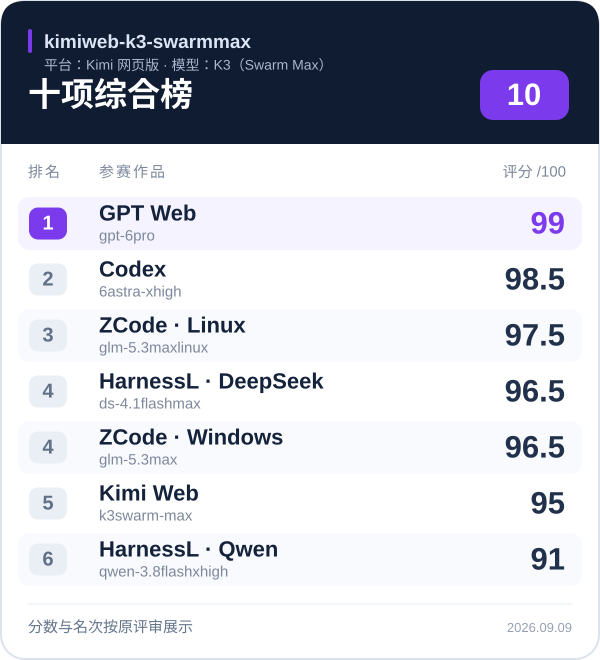
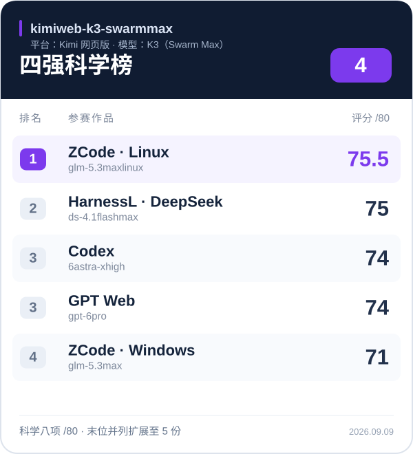
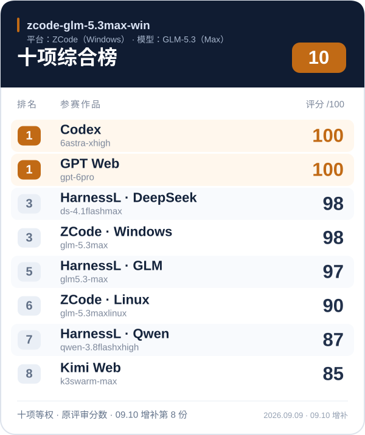
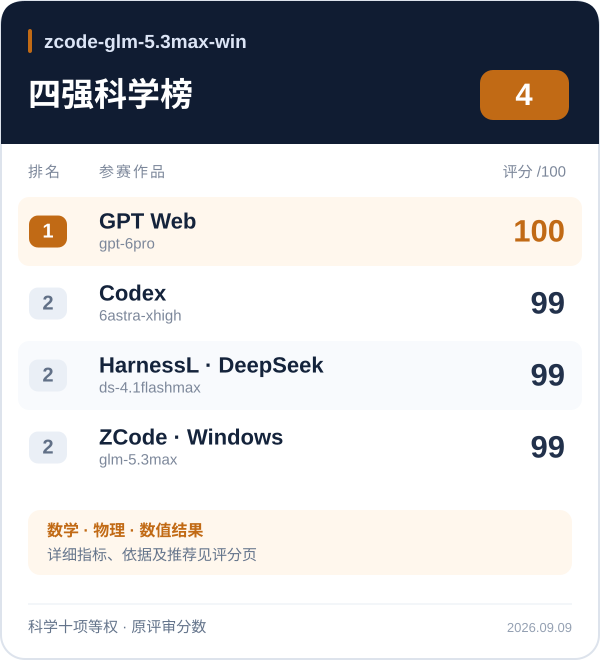

# LLM × Harness 科学计算基准

同一道地月三体问题，比较不同 **Harness＋LLM** 能否交付数学正确、数值可信、可以实际操作的科学计算程序。当前收录 **7 份参赛作品、4 位 AI 评审的“10＋4”评分**，评审日期为 2026-09-09。

## 任务是什么

创建一个可直接在浏览器运行的单文件 HTML **“地月限制性三体问题实验室”**。采用圆型限制性三体模型（CR3BP）：地球与月球绕共同质心做圆周运动，航天器质量忽略不计。程序需要：

- 在旋转坐标系中实时积分轨迹，计算 L1–L5 拉格朗日点和零速度曲线。
- 实现 RK4 和一种适合长期模拟的积分器；支持调初值、步长、暂停、单步与视图操作，显示 Jacobi 常数及其漂移。
- 提供 L4 扰动、L1 不稳定运动、绕地轨道和月球引力辅助预设，并实际验证平衡点残差、步长收敛、守恒误差与数值异常防护。

轨迹必须实时计算，自检必须真实执行。完整提示词、评分尺度与封顶规则见 [基准任务与评分标准](BENCHMARK.md)；作品存放于 [submissions](submissions/)。

## 比的是什么

这里的 **Harness** 指承载模型完成任务的平台、工具和执行环境。比较的是模型与这些条件共同产出的最终作品，包括科学建模、数值求解、验证与交互交付；参赛名称按提交者标注保留，Windows 与 Linux 产物分别计入。当前记录没有统一所有组合的算力、时间和工具预算，结论限于本轮作品。

**10 榜**按十项标准综合评价全部 7 份作品的科学、工程与交互表现；**科学榜**只对入围作品的最终数学、物理和数值结果复评，不计界面或中间工程材料。

“10”指评分维度，前八项是科学与数值计算，后两项是工程验证与交互表达；“4”指每位评审综合榜的前四名，Kimi 评审因入选边界并列扩展至五份。缺少中间工程文件不构成科学榜扣分理由。

## 综合评价与推荐

**综合交付首选 `gptweb × gpt-6pro`；若优先考虑最终数值精度，首选 `harnessL × ds-4.1flashmax`。** 这是对现有评审的归纳，具体选择取决于使用目标：

| 使用目标 | 推荐 Harness＋LLM | 现有评审支持 |
|---|---|---|
| 完整、严谨且便于操作的科学实验室 | **gptweb × gpt-6pro**（ChatGPT 网页版） | 四份综合榜记录均为第一，其中一次并列；单位与坐标说明、科学验证和可视化交付较完整。 |
| 优先检验轨迹精度与自适应求解结果 | **harnessL × ds-4.1flashmax** | 四份科学榜均在前二，两份列第一；高阶固定步与自适应方法在所测工况中取得了较强的数值结果。 |
| 综合与科学表现都稳定的另一选择 | **Codex × 6astra-xhigh** | 四份综合榜均在前二，科学榜均在前三（含并列）；方程、单位定义和独立参考核验得到多份评审肯定。 |

多份评审认可领先作品的基本运动方程、Jacobi 常数和平衡点计算；主要差距出现在**轨迹误差、长期数值行为、边界处理，以及演示中的物理声明能否复算**。尤其是 GPT Web 与 Codex，两份数值复评在对齐条件后发现其共同 RK4 方法结果基本一致，不能仅凭默认演示读数不同判断谁的方程错了。比较轨迹前应对齐初值、单位、参考系与积分设置，再与独立参考解核对。[Codex 数值复评](reviews/2026-09-09/science-final/README.md) · [GPT Web 数值复评](reviews/2026-09-09/gptweb-gpt-6-astra-pro/science-final/SCIENCE_REVIEW.md)

**面向重视数学与天体力学的传统专家团队，本页建议优先送审 DS 的数值结果，同时提供 GPT Web 作为完整科学演示的对照。** 科学首选并未形成一致意见：Codex 与 GPT Web 评审选 DS；[Kimi 评审](reviews/2026-09-09/kimiweb-k3-swarmmax/README.md#four) 更重视其规定步长、长期守恒与边界测试下的表现，选 ZCode Linux × GLM-5.3max；[ZCode／GLM 评审](reviews/2026-09-09/zcode-glm-5.3max-win/science-final/README.md) 更重视单位闭合、动力学演示和科学解释，选 GPT Web。GLM Linux 只进入了 Kimi 的科学终评，其他评审未对它做同一阶段的比较。首选随测试与权重变化，少量分差不足以证明普遍优势。

> **如何读这些结论：** 四份记录分别保留原始分数。GPT Web 评审的十项评分在复核后沿用了已有统一榜，不能把相同分数当成两次独立估计，见[评分来源说明](reviews/2026-09-09/gptweb-gpt-6-astra-pro/README.md#gptweb-gpt-6-astra-pro-ten)。科学榜的指标、权重和入围集合不同（Kimi 为 /80，其余为 /100），本页不直接平均总分，也不把这些 AI 评审解释为人类专家投票概率。

## 各位专家的评分与排名

卡片上方注明的是**评审者的模型与平台**，卡片内列出的是**参赛组合**；点击卡片或下方链接可查看单项排名、扣分理由和数值依据。后续评审也按“十项综合榜＋四强科学榜”展示。

### codex-gpt-6-astra-xhigh

**评审平台：Codex · 评审模型：GPT-6 Astra（xhigh）**

 

[十项具体评分与单项排名](reviews/2026-09-09/codex-gpt-6-astra-xhigh/README.md#10-个单项排名) · [四强具体评分与推荐](reviews/2026-09-09/science-final/README.md)

### gptweb-gpt-6-astra-pro

**评审平台：ChatGPT 网页版 · 评审模型：GPT-6 Astra Pro**

 

[十项具体评分与单项排名](reviews/2026-09-09/gptweb-gpt-6-astra-pro/README.md#gptweb-gpt-6-astra-pro-ten) · [四强具体评分与推荐](reviews/2026-09-09/gptweb-gpt-6-astra-pro/README.md#gptweb-gpt-6-astra-pro-four)

### kimiweb-k3-swarmmax

**评审平台：Kimi 网页版 · 评审模型：K3（Swarm Max）**

 

[十项具体评分与单项排名](reviews/2026-09-09/kimiweb-k3-swarmmax/README.md#ten) · [四强具体评分与推荐](reviews/2026-09-09/kimiweb-k3-swarmmax/README.md#four)

### zcode-glm-5.3max-win

**评审平台：ZCode（Windows） · 评审模型：GLM-5.3（Max）**

 

[十项具体评分与单项排名](reviews/2026-09-09/zcode-glm-5.3max-win/README.md) · [四强具体评分与推荐](reviews/2026-09-09/zcode-glm-5.3max-win/science-final/README.md)
